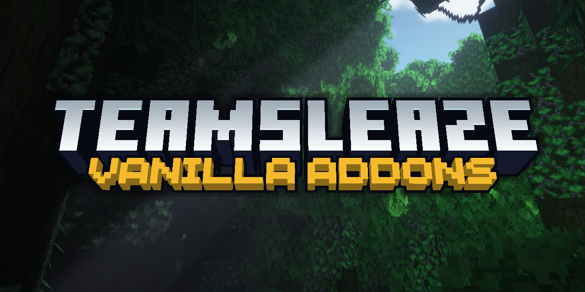

# VanillaAddons (for Fabric)

  
  
    

### About

VanillaAddons is a free and open-source Minecraft mod which aims to add vanilla friendly features to the game.

If you do encounter an issue where VanillaAddons breaks, please don't hesitate to
[open an issue.](https://github.com/TeamSleaze/VanillaAddons/issues) Each patch is carefully checked to ensure
vanilla parity, but after all, bugs are unavoidable. Before opening a new issue, please check using the search tool that your issue has not already been created, and that if
there is a suitable template for the issue you are opening, that it is filled out entirely. Issues which are duplicates
or do not contain the necessary information to triage and debug may be closed. 

### Community

You can use [github discussions](https://github.com/TeamSleaze/VanillaAddons/discussions) to ask questions and post ideas for features to be added to the project.

## Installation

### Manual installation (recommended)

You will need Fabric Loader installed in your game in order to load VanillAddons. If you haven't installed Fabric mods
before, you can find a variety of community guides for doing so [here](https://fabricmc.net/wiki/install).

#### Stable releases

The latest releases of VanillaAddons are published to our
[GitHub release](https://github.com/TeamSleaze/VanillaAddons/releases) page. Releases are considered by our team to be
**suitable for general use**, but they are not guaranteed to be free of bugs and other issues.

Usually, releases will be made available on GitHub slightly sooner than other locations.

#### Bleeding-edge builds (unstable)

If you are a player who is looking to get your hands on the latest **bleeding-edge changes for testing**, consider
taking a look at our [beta releases](https://github.com/TeamSleaze/VanillaAddons/tags). 

Bleeding edge builds will often include unfinished code that hasn't been extensively tested. That code may introduce
incomplete features, bugs, crashes, and all other kinds of weird issues. You **should not use these bleeding edge builds** unless you are aware that they can be game breaking. 

### CurseForge

If you are using the CurseForge client, you can continue to find downloads through our
[CurseForge page](https://www.curseforge.com/minecraft/mc-mods/vanillaaddons). Unless you are using the CurseForge
client, you should prefer the downloads linked on our GitHub release page above.

### Configuration

Out of the box, no additional configuration is necessary once the mod has been installed.

---

### Known issues

- Igniting too many Gunpowder Barrels causes the client to crash due to a RAM overload [#6](https://github.com/TeamSleaze/VanillaAddons/issues/6)
- Rose Gold Shield texture breaks when blocking [#8](https://github.com/TeamSleaze/VanillaAddons/issues/8) 

---

### Support the developers

VanillaAddons is made possible by the following core contributors [and others](https://github.com/TeamSleaze/VanillaAddons/graphs/contributors).
You can help support members of the core team by making a pledge to our KoFi and Patreon pages below.

|                                                                                | Author      | Role                           | Links                                                                                                                             |
| ------------------------------------------------------------------------------ | ----------- | ------------------------------ | --------------------------------------------------------------------------------------------------------------------------------- |
|  | SleazeStiKs | Project Lead, Main Development | [KoFi](https://ko-fi.com/sleaze) / [Contributions](https://github.com/TeamSleaze/VanillaAddons/commits?author=sleazestiks)         |
|    | RobaCZ      | Development                    | [Patreon](https://www.patreon.com/m/robadev) / [Contributions](https://github.com/TeamSleaze/VanillaAddons/commits?author=robacz) |

---

### License

VanillaAddons is licensed under CC0. For more information, please see the
[license file](LICENSE.txt).

